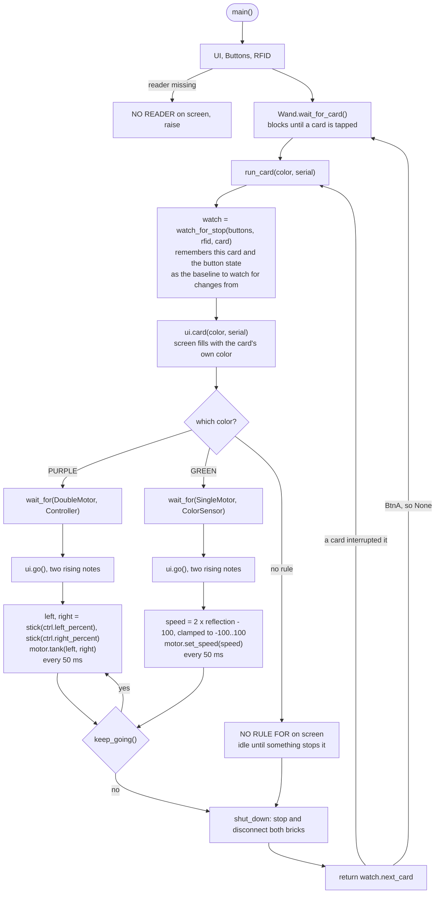
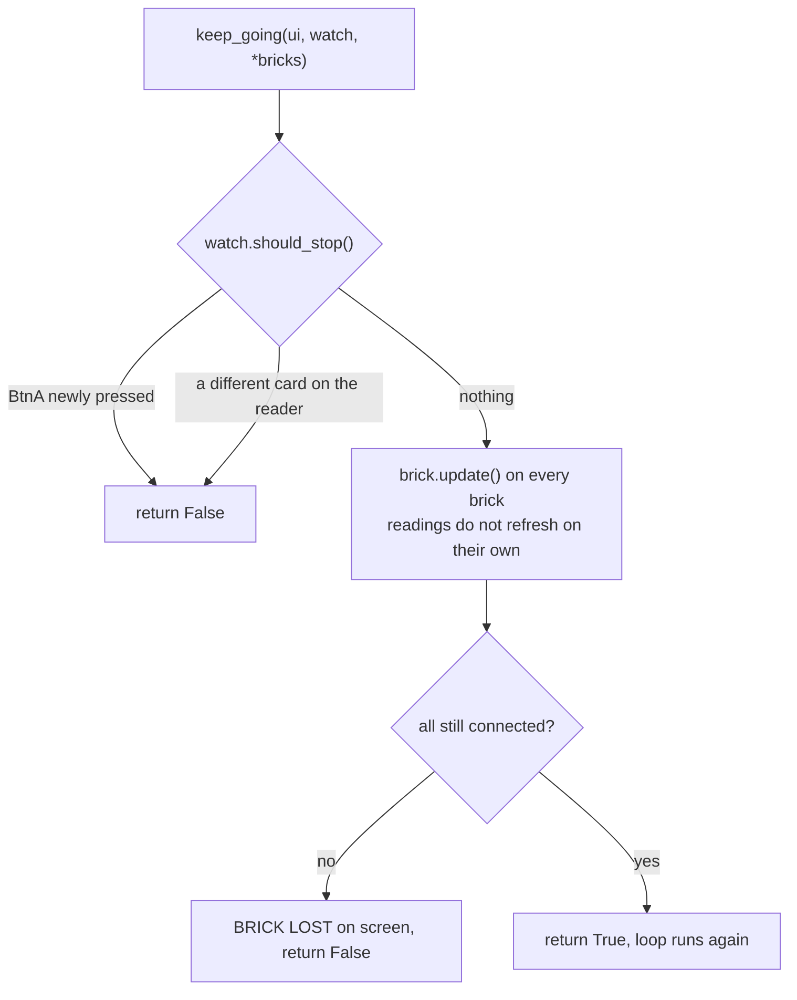

# Wand_driving

Tap a LEGO Education connection card on the Stick's RFID reader and the card's
**color picks a behavior**. The Stick waits for that behavior's two bricks to
turn up over BLE, connects to both, then runs them until you press BtnA or tap
a different card.

Runs **on** the M5StickS3. Needs [`m5/`](../m5/) and the Grove RFID2 Unit. All
the LEGO and BLE machinery lives in [m5_wand.md](m5_wand.md); this file is just
the program that drives it.

| Card | Bricks it waits for | What it does |
|---|---|---|
| PURPLE | Double Motor + Controller | one joystick per wheel |
| GREEN | Single Motor + Color Sensor | reflected light drives it, brighter is faster |
| anything else | — | says `NO RULE FOR <color>` and waits for another card |

## Flow

The loop closes at the bottom: `run_card()` hands back whichever card
interrupted it, so tapping a second card switches straight to it without going
back through `wait_for_card()`. BtnA returns `None` instead, which sends `main`
back to the `TAP A CARD` screen.

While `wait_for()` is still connecting bricks, the same two stop conditions
arrive as a `Wand.Cancelled` exception rather than a return value — that is
what lets you abandon a card whose bricks never switch on.

## What ends a run

Two details that are easy to miss:

- The card **currently in play is ignored**. Left lying on the reader it would
  otherwise read as a new tap every 600 ms and restart itself forever.
- BtnA is **edge-detected from the state at construction**, so a button still
  held down from stopping the previous card does not instantly stop this one.

## The functions

| Function | Does |
|---|---|
| `main()` | Sets up the screen, buttons and reader, then loops over cards forever |
| `run_card()` | One card: build the watch, paint the screen, dispatch on color |
| `purple_card()` / `green_card()` | Wait for that color's two bricks, then drive them |
| `other_card()` | A color with no rule — say so about the rule, not about the room |
| `wait_for()` | Connect to each brick class in turn, cleaning up if interrupted |
| `keep_going()` | Refresh the bricks and decide whether the drive loop runs again |
| `stick()` | Deadzone — a centred joystick still reads a few percent |
| `show()` | The two big readout lines, repainted only when they change |

`show()` is gated on change because repainting two scale-2 lines every 50 ms is
enough SPI traffic to make the sticks feel laggy.
